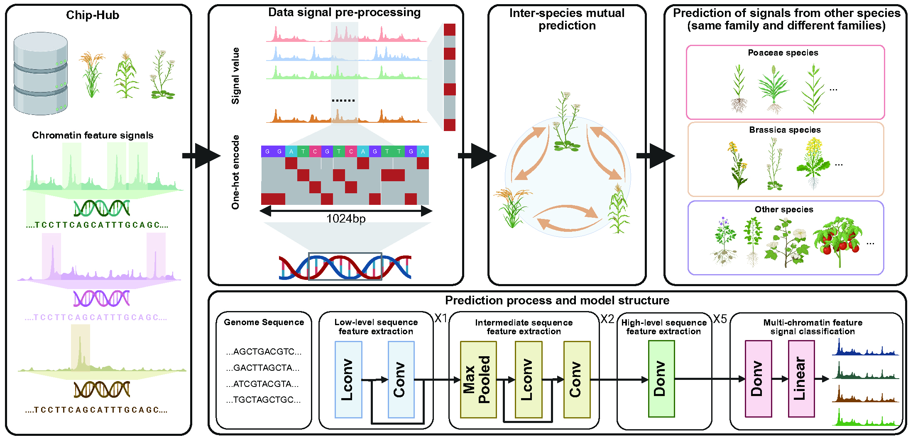

# SeiPlant
**SeiPlant** is a deep learning framework for predicting histone modification patterns in plant genomes. Built upon 
the Sei architecture, this model enables high-resolution inference of chromatin states directly from raw DNA sequences 
across diverse plant species.

## Key Features

- Cross-species modeling for plant epigenomics
- Multi-task prediction of histone marks (e.g., H3K4me3, H3K27ac)
- Tested on representative monocots and dicots (e.g., *Oryza sativa*, *Zea mays*, *Arabidopsis thaliana*)
- Supports both species-specific and generalization settings
- One-click sequence-to-signal pipeline outputting BigWig and BedGraph

## Schematic Diagram

<div style="text-align: center;">
    
</div>

Figure 1. Workflow of the SeiPlant framework for cross-species prediction of chromatin features in plants.

## Quick Start

### Download the GitHub Repository
[Download](https://github.com/Linliu-Bioinf/SSGATE/archive/refs/heads/main.zip) this GitHub repository, and extract the contents into a folder.

### Data Description

`Note:` SSGATE requires data in [anndata](https://anndata.readthedocs.io/en/latest/) format as inputs. 
The expression profiles are required to be stored in anndata.X, otherwise the data cannot be read 
correctly. The spatial coordinates from spatial multi-omics data are required to be stored in 
`anndata.obsm['spatial']`, otherwise it will be processed as single-cell multi-omics data due to 
the spatial information cannot be read.

We provide the datasets used in this study, which are stored in the BGI cloud disk.
[Link](https://bgipan.genomics.cn/#/link/vkxFIxtLWYRBXeHgHwlW)
Extract password is :nrEB


## Install and use it by Git
```bash
### Python enviroment constructed by Conda
conda create -n SSGATE python=3.9
conda activate SSGATE
git clone https://github.com/Linliu-Bioinf/SSGATE.git
cd SSGATE
python setup.py install

pip install -r requirements.txt
```


## Install and use it by STOmics Cloud Platform
We recommend using [STOmics Cloud Platform](https://cloud.stomics.tech/) to access and use it.
Users can use the public image of the STOmics Cloud Platform: `SSGATE`. The dependency files related to 
running `SSGATE` have been configured.

## Parameter Explanation
### Step 1:Neighborhood network construction
Before running SSGATE for multi-omics joint feature analysis, you must use the `Cal_Nbrs_Net` function to construct a neighbor 
network for a single omics data (transcriptome or proteome).

    adata = Cal_Nbrs_Net(adata, 
                         feat='X_pca', 
                         rad_cutoff=None, 
                         k_cutoff=None, 
                         model='Radius'):

#### Parameters of `Cal_Nbrs_Net`:

- **`adata`**: 
  - An AnnData object where `obsm` contains spatial coordinates or coordinate information.

- **`feat`** (default: `'X_pca'`):
  - The feature matrix used to calculate the neighbors. Can be either reduced coordinates (`'X_pca'`) or spatial coordinates (`'spatial'`).

- **`rad_cutoff`** (default: `None`):
  - When using the radius neighbor model, defines the neighborhood radius. If using the Radius model, this value must be provided.

- **`k_cutoff`** (default: `None`):
  - Defines the number of neighbors when using the KNN model. This value is required if the KNN model is used.

- **`model`** (default: `'Radius'`):
  - Specifies the type of model to use. Possible values are `'Radius'` and `'KNN'`.


return value:
- **`adata`**: The updated AnnData object, containing the calculated neighboring network information, is stored in 
    adata.uns['nbrs_net'].

### Step 2:Network pruning
This function is used to prune the adjacency network calculated by the `Cal_Nbrs_Net` function, ensuring that each edge 
only connects cells within the same cell population. After pruning, the updated adjacency network will be stored in 
the uns attribute of the AnnData object.

    adata = prune_net(adata)

return value:
- **`adata`**: The updated AnnData object, containing the pruned neighbor network information, is stored in uns['nbrs_net'].

### Step 3:Training
After completing the above two steps, training can be carried out. After multiple rounds of training, the joint feature 
representation of the two omics can be obtained.

    adata_st, adata_sp = ssgate.train(adata_st, 
                                      adata_sp, 
                                      hidden_dims1 = 128, 
                                      hidden_dims2 = 128, 
                                      out_dims = 30, 
                                      cluster_update_epoch = 20, 
                                      epochs_init = 50, 
                                      n_epochs=300, 
                                      lr=0.001,
                                      sigma = 0.1)

#### Hyperparameters of `train`:

- **`adata1`**:
  - **Description**: The spatial transcriptomics data in the form of an AnnData object. This object should contain the expression data and spatial coordinates of cells.
  - **Type**: AnnData object

- **`adata2`**:
  - **Description**: The spatial proteomics data in the form of an AnnData object. Similar to `adata1`, it should contain protein expression data and spatial coordinates of cells.
  - **Type**: AnnData object

- **`hidden_dims1`** (default: `128`):
  - **Description**: The dimensionality of the hidden layer for the first dataset (`adata1`). This defines the number of neurons in the hidden layer for processing the transcriptomics data.
  - **Type**: Integer

- **`hidden_dims2`** (default: `128`):
  - **Description**: The dimensionality of the hidden layer for the second dataset (`adata2`). This defines the number of neurons in the hidden layer for processing the proteomics data.
  - **Type**: Integer

- **`out_dims`** (default: `30`):
  - **Description**: The dimensionality of the output layer. This is the size of the embedding space where the integrated features from both datasets will be projected.
  - **Type**: Integer

- **`n_epochs`** (default: `200`):
  - **Description**: The total number of epochs for training the model. An epoch is one complete pass through the entire training dataset.
  - **Type**: Integer

- **`lr`** (default: `0.001`):
  - **Description**: The learning rate for the optimizer. It controls how much to change the model parameters at each step of the optimization.
  - **Type**: Float

- **`epochs_init`** (default: `100`):
  - **Description**: The number of initial epochs for pretraining before clustering updates are applied. During this phase, the model is trained to learn initial embeddings without updating clusters.
  - **Type**: Integer

- **`cluster_update_epoch`** (default: `100`):
  - **Description**: The interval (in epochs) at which clustering is updated during training. This means the clustering labels are updated every `cluster_update_epoch` epochs.
  - **Type**: Integer

- **`sigma`** (default: `0.1`):
  - **Description**: The weighting factor for the triplet loss in the overall loss calculation. This controls the importance of the triplet loss relative to the reconstruction loss.
  - **Type**: Float

##  SSGATE Reproduction Scripts

We provide scripts for reproducing the results of the SSGATE paper, as detailed below:

### Single-Cell Multi-Omics Datasets
1. **BMNC Dataset Reproduction:**
   - Script file: [Tutorial_of_SSGATE_BMNC.ipynb](./Tutorial/Tutorial_of_SSGATE_BMNC.ipynb)

2. **SLN_111_D1 Dataset Reproduction:**
   - Script file: [Tutorial_of_SSGATE_SLN111D1.ipynb](./Tutorial/Tutorial_of_SSGATE_SLN111D1.ipynb)

### Converting single-cell multi-omics data between different data formats
1. **BMNC Dataset Tranverse:**
   - Script file: [BMNC_h5_h5ad_rds](./Tutorial/BMNC_h5_h5ad_rds)

2. **SLN_111_D1 Dataset Tranverse:**
   - Script file: [SLN111D1_h5ad_rds](./Tutorial/SLN111D1_h5ad_rds)

### Spatial Multi-Omics Dataset and Downstream Analysis

- Script file: [Tutorial_of_SSGATE_SCS_MT.ipynb](./Tutorial/Tutorial_of_SSGATE_SCS_MT.ipynb)
- Presudo-time Analysis used Monocle3:  [TutorIal_of_Monocle3.Rmd](./Tutorial/Tutorial_of_Monocle3.ipynb)
- GO analysis used ClusterProfiler: [Tutorial_of_GO_analysis.Rmd](./Tutorial/Tutorial_of_ClusterProfiler.ipynb)


## Citation
If you use `SSGATE` in your work, please cite it.
> **Multi-omics integration for both single-cell and spatially resolved data based on dual-path graph attention auto-encoder**
>
> Tongxuan Lv, Yong Zhang, Junlin Liu, Qiang Kang, Lin Liu
> 
> _Briefings in Bioinformatics_ 2024 September 18. doi: [https://doi.org/10.1093/bib/bbae450](https://doi.org/10.1093/bib/bbae450).


## Conflict of interest
The authors declare that they have no conflicts of interest.

## Contact
Any questions or suggestions on SSGATE are welcomed! Please report it on issues, 
or contact Lin Liu (liulin4@genomics.cn).