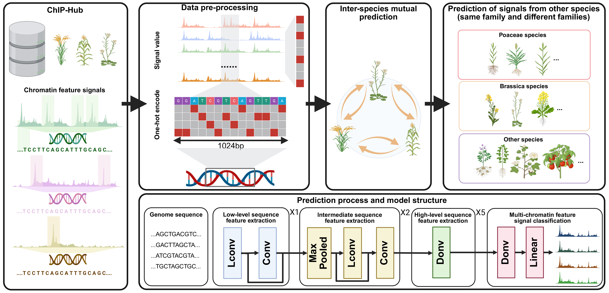

# SeiPlant
**SeiPlant** is a deep learning framework for predicting histone modification patterns in plant genomes. Built upon 
the Sei architecture, this model enables high-resolution inference of chromatin states directly from raw DNA sequences 
across diverse plant species.

## Schematic Diagram

<div style="text-align: center;">
    
</div>

Figure 1. Workflow of the SeiPlant framework for cross-species prediction of chromatin features in plants.

## Key Features
- Cross-species modeling for plant epigenomics
- Multi-task prediction of histone marks (e.g., H3K4me3, H3K27ac)
- Tested on representative monocots and dicots (e.g., *Oryza sativa*, *Zea mays*, *Arabidopsis thaliana*)
- Supports both species-specific and generalization settings
- One-click sequence-to-signal pipeline outputting BigWig and BedGraph

## Quick Start
### Install and use it by Git

```bash
### Python enviroment constructed by Conda
conda create -n SeiPlant python=3.6
conda activate SeiPlant
git clone https://github.com/Lv-BioInfo/SeiPlant.git
pip install -r requirements.txt
```

### Step 1: Prepare FASTA Input and Generate Genomic Windows

Provide a reference genome in **FASTA** format for the species of interest. To tile the genome:

- Apply a **sliding window** approach (default: 1,024 bp window, 128 bp step size)
- Filter windows to retain only sequences with **standard nucleotides** (A/T/C/G)
- Save:
  - **BED** file for genomic coordinates
  - **FASTA** file for model input sequences

Example usage:
```bash
python make_prediction_bed.py \ 
  --fasta fasta/arabidopsis_thaliana.fa \
  --size fasta/arabidopsis_thaliana.size \
  --species arabidopsis_thaliana \
  --output_path ./bed/ \
  --window_size 1024 \
  --step_size 128
```

> You may also download example reference genomes and pre-processed input from [Zenodo](https://zenodo.org/) or  *(links provided in `/data` folder)*

---

### Step 2: Run Prediction Using Pretrained SeiPlant Model

Feed the `.fasta` file into the pretrained **SeiPlant** model to obtain chromatin feature predictions.

- Predicts probability scores for multiple histone modifications:
  - **H3K4ME3**, **H3K27AC**, **H3K4ME1**, **H3K9AC**, **H3K36ME3**
- Output: `.npy` file containing **multi-label** prediction scores aligned with each genomic window

Post-process model predictions into standard genome browser formats:

1. **Align scores** to central genomic coordinates (e.g., `start+448`, `end–576`)
2. **Filter** weak signals (< 0.01) and **normalize** (Min–Max scaling to 0.1–1.0)
3. Export **per-mark BedGraph files**
4. Convert to **BigWig** using UCSC’s `bedGraphToBigWig`

Example usage:
```bash
python prediction.py --model_path ./models/Brassicaceae_20250312_203749_1024_nip_feature7.model \
  --model_tag_file ./models/histone_modification_tag.txt \
  --species arabidopsis_thaliana \
  --fa_path ./bed/arabidopsis_thaliana_1024_128.fa \
  --output_dir ./bedgraph \
  --seq_len 1024 \
  --batch_size 256
```

---

### Step 3: Exchange Signal Files (BedGraph & BigWig)
Example command:
```bash
bedGraphToBigWig H3K4ME3.bedgraph chrom.sizes H3K4ME3.bw
```

## Contact
Any questions or suggestions on SeiPlant are welcomed! Please report it on issues, or contact Dijun Chen (dijunchen@nju.edu.cn).